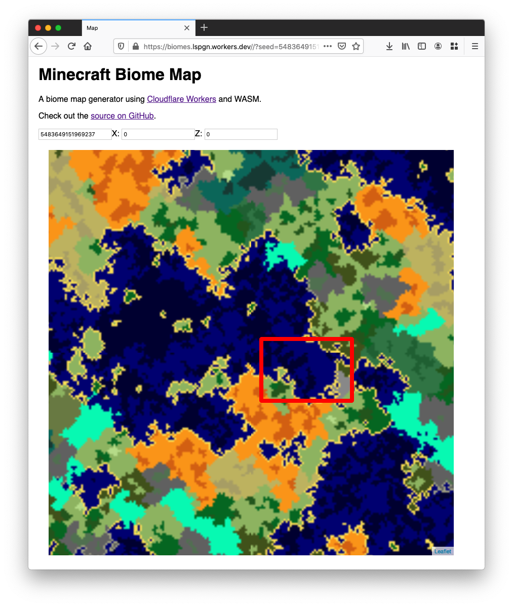
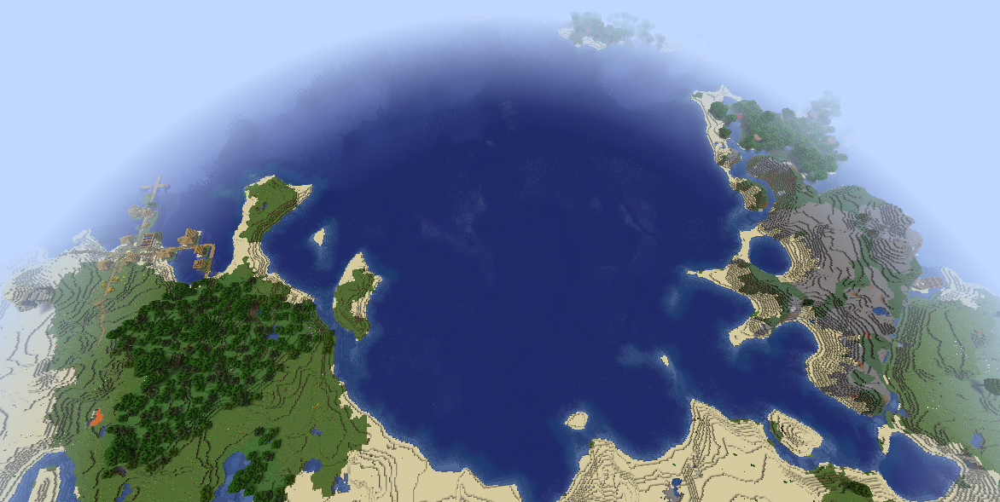

# Worker Biomes


## Introduction

Minecraft generates its environment using an initial _seed_.
This method is called [procedural generation](https://en.wikipedia.org/wiki/Procedural_generation).

A user can recreate a _world_ in by passing the same seed.

**Worker Biomes** is similar to tools like [AMIDST](https://github.com/toolbox4minecraft/amidst)
with the difference that it runs in your browser.

This application uses [Cloudflare Workers](https://workers.cloudflare.com/),
a [serverless platform](https://en.wikipedia.org/wiki/Serverless_computing):
the code is sent at the edge and runs on servers all around the world.
The user does not need to maintain hardware, only code.

This is made with a C [biome generation library](https://github.com/Cubitect/cubiomes),
a [PNG image library](https://github.com/nothings/stb) compiled with
[emscripten](https://emscripten.org/) ([WebAssembly](https://en.wikipedia.org/wiki/WebAssembly)).
A JavaScript frontend using [leaflet](https://leafletjs.com/)
provides a map the user can explore.

This project was done for fun and to test Cloudflare Workers and WASM.
It is not actively supported and could definitely use optimizations.

## Demo

The demo is available on: https://biomes.lspgn.workers.dev.

Let's use the seed: `5483649151969237`.

At position `(0, 0)` the map is the following:

[](https://biomes.lspgn.workers.dev/?seed=5483649151969237&x=0&z=0)

You can see the area wit the red border represented below in the game:



## Installing

Make sure you have a Cloudflare account.
Follow this guide to get [API tokens](https://developers.cloudflare.com/api/tokens/create).

The free version of Workers allows up to 100000 requests a day.
You can deploy on workers.dev if you do not want to setup a zone and a domain
but you will not be able to control caching, firewall or rate-limiting parameters.

A tile generation takes around 5ms. This Worker uses the cache API to serve
tiles even faster. One tile is around 10KB.
A quick exploration may fetch 50-100 tiles.

In order to proceed, edit `wrangler.toml`:
* the `name` of your worker (default is biomes)
* the `account_id` (you can find it in the dashboard on the Workers page)

In `webpack.config.js` edit the following:
* `PUBLISH_ADDRESS`: this will define the endpoint to fetch tiles and allow the HTTP Referer
  check to avoid image hotlinking.
* `SEED`: if you want the default seed to be fixed (by default, it is random at build time).

The repository is already configured with [GitHub actions](https://github.com/features/actions).
GitHub can compile and deploy for you if you define `CF_ACCOUNT_ID` and `CF_API_TOKEN`
as secret environment variables.

If you choose to deploy manually, you will need to install
[Wrangler](https://developers.cloudflare.com/workers/tooling/wrangler/install/),
configure it with your account (`$ wrangler config`) and
fetch the submodules.

```bash
$ git submodule update --init --recursive
$ wrangler build
$ wrangler publish
```

And you're done!

Note: you can upload (without Wrangler) the WASM-compiled file via the
[API](https://developers.cloudflare.com/workers/tooling/api/scripts#with-resource-bindings)
after running `npx webpack`.

## Credits and notes

The [Cloudflare Emscripten Template](https://github.com/cloudflare/worker-emscripten-template)
was very useful for this project.
The project was made possible with the [Cubiomes](https://github.com/Cubitect/cubiomes) library
and the [stb library](https://github.com/nothings/stb). A big thank you to the maintainers.

This program comes with absolutely no warranty and is not associated with Mojang AB.

Minecraft is a Trademark of Mojang AB. Please check the
[Commercial Guidelines](https://account.mojang.com/documents/commercial_guidelines).
